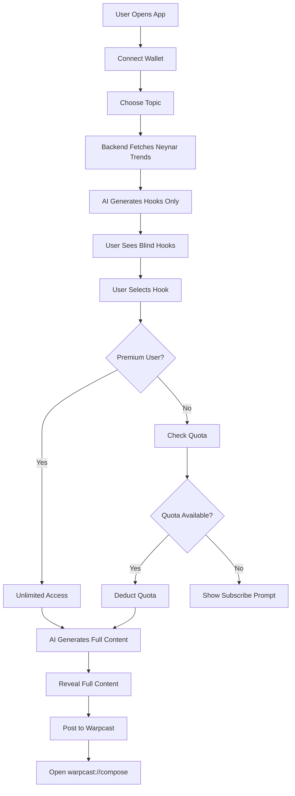

# HookLab AI

> A Farcaster-native mini app on Base that helps creators generate high-performing hooks using real social trend data, with blind hook selection and onchain subscription payment.

## 🎯 One-Liner

**HookLab AI**: Generate viral Farcaster hooks powered by real Base channel trends, with blind selection and onchain premium subscriptions.

---

## 🏗️ Architecture Overview

### Three-Layer Separation

```
┌─────────────────────────────────────────────────────────────┐
│                        FRONTEND                              │
│  Next.js + OnchainKit + Mobile-First UI                     │
│  • Wallet connection                                         │
│  • Topic selection                                           │
│  • Blind hook display                                        │
│  • Warpcast deep link                                        │
└─────────────────────────────────────────────────────────────┘
                            ↓
┌─────────────────────────────────────────────────────────────┐
│                    BACKEND (API Routes)                      │
│  Next.js API Routes - Single Source of Truth                │
│  • Quota enforcement                                         │
│  • Premium verification (reads contract)                     │
│  • Neynar data fetching                                      │
│  • AI orchestration (Eigen AI + Gemini)                      │
└─────────────────────────────────────────────────────────────┘
                            ↓
┌─────────────────────────────────────────────────────────────┐
│                   SMART CONTRACT (Base)                      │
│  Foundry - HookLabSubscription.sol                           │
│  • subscribeMonthly() - x402 payment                         │
│  • isPremium(address) - view function                        │
│  • Subscribed event emission                                 │
└─────────────────────────────────────────────────────────────┘
```

---

## 🚀 Core Features

### 1. Blind Hook Selection
- AI generates multiple hooks
- User sees **only hooks** (first sentence, ≤120 chars)
- No body content visible
- Selecting a hook **consumes quota**
- Full content revealed **only after selection**

### 2. Trend-Jacking
- Fetches high-engagement Farcaster posts from Base channel
- Calculates hook strength: `(likes + recasts + replies) / follower_count`
- AI uses structure and patterns (not copying)
- Crypto-native, timely output

### 3. Quota & Subscription
- **Free users**: Limited credits (default: 5)
- **Premium users**: Unlimited
- Premium status determined **onchain**
- Backend reads contract, enforces quota

---

## 📁 Project Structure

```
hackathon-hooklabai/
├── src/                          # Smart contracts (Foundry)
│   └── HookLabSubscription.sol
├── script/
│   └── Deploy.s.sol
├── test/
│   └── HookLabSubscription.t.sol
├── frontend/                     # Next.js application
│   ├── app/
│   │   ├── page.tsx
│   │   ├── layout.tsx
│   │   ├── api/                  # Backend API routes
│   │   │   ├── quota/
│   │   │   ├── hooks/generate/
│   │   │   ├── content/generate/
│   │   │   └── premium/verify/
│   │   └── components/
│   │       ├── WalletConnect.tsx
│   │       ├── TopicSelector.tsx
│   │       ├── HookSelector.tsx
│   │       ├── ContentReveal.tsx
│   │       └── SubscribeButton.tsx
│   └── lib/
│       ├── supabase.ts
│       ├── neynar.ts
│       ├── ai.ts
│       └── contract.ts
└── README.md
```

---

## 🛠️ Tech Stack

| Layer | Technology |
|-------|------------|
| **Smart Contract** | Foundry, Solidity ^0.8.13, Base |
| **Frontend** | Next.js (App Router), Coinbase OnchainKit, Wagmi, Viem |
| **Backend** | Next.js API Routes |
| **AI** | Eigen AI (orchestration), Gemini (LLM) |
| **Data** | Neynar API (Farcaster), Supabase (quota/users) |
| **Deployment** | Vercel (frontend), Base (contract) |

---

## 🔧 Setup Instructions

### Prerequisites
- Node.js 18+
- Foundry ([install](https://book.getfoundry.sh/getting-started/installation))
- Supabase account
- Neynar API key
- Eigen AI + Gemini API keys
- Base wallet with testnet ETH

### 1. Clone Repository
```bash
git clone <repo-url>
cd hackathon-hooklabai
```

### 2. Smart Contract Setup
```bash
# Install dependencies
forge install

# Build contracts
forge build

# Run tests
forge test -vvv

# Deploy to Base (testnet or mainnet)
cp .env.example .env
# Fill in PRIVATE_KEY, BASE_RPC_URL, ETHERSCAN_API_KEY
forge script script/Deploy.s.sol --rpc-url $BASE_RPC_URL --broadcast --verify
```

### 3. Supabase Setup
1. Create a new Supabase project
2. Run the following SQL in the SQL Editor:

```sql
-- Users table
CREATE TABLE users (
  id UUID PRIMARY KEY DEFAULT uuid_generate_v4(),
  wallet_address TEXT UNIQUE NOT NULL,
  is_premium BOOLEAN DEFAULT FALSE,
  premium_expiry TIMESTAMP,
  created_at TIMESTAMP DEFAULT NOW()
);

-- Quotas table
CREATE TABLE quotas (
  id UUID PRIMARY KEY DEFAULT uuid_generate_v4(),
  wallet_address TEXT UNIQUE NOT NULL,
  remaining_credits INTEGER DEFAULT 5,
  updated_at TIMESTAMP DEFAULT NOW()
);

-- Usage logs table
CREATE TABLE usage_logs (
  id UUID PRIMARY KEY DEFAULT uuid_generate_v4(),
  wallet_address TEXT NOT NULL,
  topic TEXT,
  selected_hook TEXT,
  created_at TIMESTAMP DEFAULT NOW()
);
```

3. Copy your Supabase URL and anon key

### 4. Frontend Setup
```bash
cd frontend

# Install dependencies
npm install

# Create environment file
cp .env.example .env.local

# Fill in environment variables:
# NEXT_PUBLIC_CHAIN_ID=8453
# NEXT_PUBLIC_CONTRACT_ADDRESS=0x... (from deployment)
# SUPABASE_URL=https://...
# SUPABASE_ANON_KEY=...
# NEYNAR_API_KEY=...
# EIGEN_AI_API_KEY=...
# GEMINI_API_KEY=...

# Run development server
npm run dev
```

### 5. Test End-to-End
1. Open http://localhost:3000
2. Connect wallet
3. Choose a topic
4. Select a hook
5. Verify quota deduction
6. View full content
7. Test Warpcast deep link

---

## 🎮 Application Flow



---

## 🧪 Testing

### Smart Contract Tests
```bash
cd contracts
forge test -vvv
```

### Manual Testing Checklist
- [ ] Wallet connection works
- [ ] Topic selection displays
- [ ] Hooks are generated (no bodies visible)
- [ ] Hook selection deducts quota
- [ ] Premium users have unlimited quota
- [ ] Full content is revealed after selection
- [ ] Warpcast deep link opens correctly
- [ ] Subscription transaction works

---

## 🎯 Hackathon Success Criteria

This project succeeds if:

1. ✅ **Demoable in <60 seconds**
2. ✅ **Architecture is defensible** under Q&A
3. ✅ **Flow is understandable** to judges
4. ✅ **Aligns with Base ecosystem goals**:
   - Onchain value (subscription)
   - Social engagement (Farcaster)
   - Creator monetization (premium)

---

## 🚨 Important Notes

### What We CAN Claim
✅ Onchain subscription payment  
✅ Premium status verified onchain  
✅ Real Farcaster trend data integration  
✅ AI-powered hook generation  
✅ Blind hook selection mechanism  

### What We CANNOT Claim
❌ Quota stored onchain (it's in Supabase)  
❌ Tracking token purchases (we track subscriptions)  
❌ Production-ready scaling  
❌ Advanced AI reasoning (it's prompt-based)  

---

## 📚 Resources

- [Foundry Book](https://book.getfoundry.sh/)
- [Coinbase OnchainKit](https://onchainkit.xyz/)
- [Neynar API Docs](https://docs.neynar.com/)
- [Base Documentation](https://docs.base.org/)
- [Farcaster Frames](https://docs.farcaster.xyz/learn/what-is-farcaster/frames)

---

## 🤝 Contributing

This is a hackathon project. Focus on:
- Speed of implementation
- Architectural clarity
- Honest, defensible technical claims

Avoid:
- Production-grade scaling
- Complex indexers
- Overengineering

---

## 📄 License

MIT
